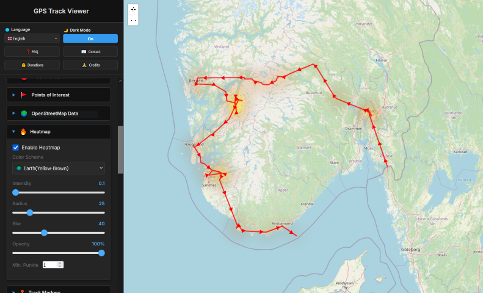
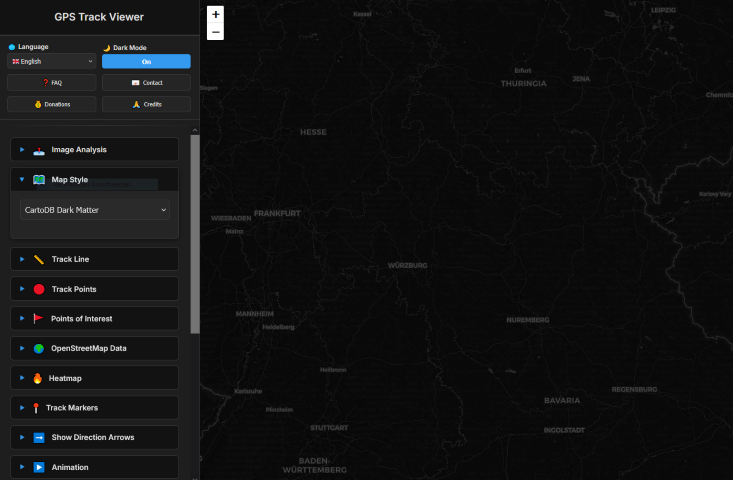
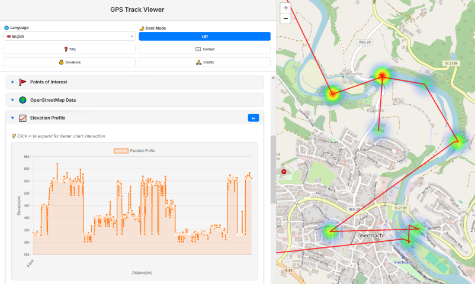
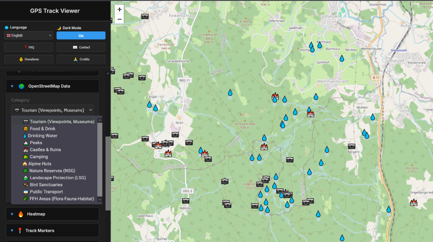

# Local Exif Geo Map 📍
A powerful, privacy-focused, browser-based tool to visualize and analyze GPS data from your photos. Simply drag and drop images to generate interactive maps, heatmaps, elevation profiles, and trip statistics.

[](https://php.net)

## Why?
I've always wanted a self-hosted tool to analyze my photos and turn them into maps. Then came my Croatian vacation, where the wind decided my hammock was its mortal enemy. At 2 AM, sleep-deprived and slightly windburnt, I retreated to the beach and coded the entire core of this app on my phone like a complete maniac.

It's still a beautiful disaster—powered by sea breeze, insomnia, and questionable life choices. But shockingly, most of it actually works.

All translations besides Bavarian (which I painstakingly did myself, because I'm apparently that specific flavor of weird) were churned out by AI, mostly [EuroLLM](https://eurollm.io/) and [Claude](https://claude.ai). So if German reads like a robot having a stroke, you know why.

## 📸 Screenshots
<a href="https://exif.vuuc.de" target="_blank">Demo URL</a>

|  |  |  |  |
|:---:|:---:|:---:|:---:|
| *Interactive Map* | *Dark Mode* | *Elevation Profile* | *Overpass Import* |

## ✨ Features

### 📷 Image Analysis
- **Drag & Drop Upload**: Simply drop photos onto the sidebar to extract GPS data
- **EXIF GPS Extraction**: Automatically reads GPS coordinates, timestamps, and elevation from image metadata
- **Orphaned Photo Sync**: **New!** Photos without GPS data are automatically placed on the map if they match the timestamp of an uploaded GPX track (needs to be tested)
- **Batch Processing**: Handle thousands of images (tested up to 50,000+ photos)
- **Progress Tracking**: Real-time progress bar during image processing

### Interactive Mapping
- **12+ Map Styles**: OpenStreetMap, Esri Satellite/Terrain, CartoDB (light/dark/voyager), OpenTopoMap, OPNV (transport), OpenRailwayMap, and more
- **Track Customization**:
  - **Line Style**: Solid, Dashed, or Dotted lines
  - **Visuals**: Adjustable line color, thickness, and opacity
- **Track Points**:
  - **Markers**: Custom shapes (circle, square, star, etc.), colors, sizes, and borders
  - **Timestamps**: Toggle permanent timestamp labels for every point
  - **Direction Arrows**: Visualize movement direction with adjustable size/spacing
- **Auto-Follow**: "Follow Mode" keeps the map centered on your position during playback

### 📍 Points of Interest & OpenStreetMap Data
- **POI Editor**: Click anywhere on the map to add custom waypoints with names and descriptions
- **OpenStreetMap Data**: Load nearby POIs directly from Overpass API (with "Server Busy" handling):
  - **Tourism**: Viewpoints, Museums, Hotels, Hostels, Information Centers, Attractions
  - **Food & Drink**: Restaurants, Cafes, Fast Food, Bars, Pubs, Biergartens
  - **Water**: Drinking Water, Springs
  - **Peaks**: Mountain Peaks (with elevation in meters)
  - **Historic**: Castles, Ruins, Monuments, Memorials, Archaeological Sites
  - **Nature**: Camping, Huts, Nature Reserves (NSG), Landscape Protection (LSG), Bird Sanctuaries (VSG), FFH Areas
  - **Transport**: Bus Stops, Train Stations
- **Info Boxes**: Click any POI to see details:
  - Name & Type
  - Elevation (if available)
  - Website Links
  - Wikipedia Links (auto-detected languages)

### 🔥 Heatmap
- **Density Visualization**: See where you spent the most time
- **5 Color Schemes**: Fire, Cool, Earth, Marine, Twilight
- **Adjustable Parameters**: Intensity, radius, blur, and opacity

### 📈 Elevation Profile
- **Interactive Chart**: Click on chart to highlight position on map and see exact statistics
- **Zoom & Pan**: Chart.js powered interactive elevation graph
- **Statistics**: Global Elevation gain/loss, min/max elevation
- **Responsive**: "Jump to Elevation Profile" link and expandable sidebar for detailed analysis

### ▶️ Animation
- **Playback Controls**: Play/pause your journey over time
- **Adjustable Speed**: 0.5x to 5x playback speed
- **Follow Mode**: Camera automatically follows current position
- **Trail Effect**: Visual path history during playback

### 📊 Statistics
- **Total Distance**: Calculated track length in km
- **Duration**: Time span from first to last photo
- **Average Speed**: Movement speed calculation
- **Point Count**: Number of GPS points from images and tracks

### 📅 Timeline
- **Chronological View**: See all track points ordered by time
- **Jump to Position**: Click timeline entries to navigate on map

### 💾 Export Options
- **PNG Export**: One-click download of the current map view as a high-quality PNG image (including all active layers, heatmaps, and markers)
- **GPX Export**: Export your analyzed photo track as a standard GPX file compatible with Strava, Garmin, Komoot, and Google Earth
- **Backup**: Save your curated map data for later use

### 🌐 Multi-Language Support
11 languages supported:
- 🇬🇧 English
- 🇩🇪 Deutsch
- 🇮🇹 Italiano
- 🇭🇷 Hrvatski
- 🇵🇱 Polski
- 🇪🇸 Español
- 🇺🇦 Українська
- 🇳🇱 Nederlands
- 🇸🇪 Svenska
- 🇳🇴 Norsk
-  Bayerisch

### 🎨 UI/UX
- **Dark Mode**: Toggle between light and dark themes (dark by default)
- **Responsive Design**: Works on desktop and mobile browsers
- **Collapsible Sections**: Organize sidebar with expandable panels
- **Toast Notifications**: User-friendly feedback messages

---

## 🔒 Privacy First

> **Your photos never leave your device!**

All GPS extraction and processing happens **entirely in your browser**. No images are uploaded to any server. The only network requests are:
- Loading map tiles (from tile providers like OpenStreetMap)
- Optional: Loading OSM POI data (from Overpass API)

This means your personal photos and location data remain 100% private.
Also, there is no logging at all from the app.

---

## 🛠️ Technologies

| Category | Technology |
|----------|------------|
| **Frontend** | HTML5, CSS3 (Vanilla), JavaScript (ES6+) |
| **Mapping** | [Leaflet.js](https://leafletjs.com/), [Leaflet.heat](https://github.com/Leaflet/Leaflet.heat), [Leaflet.PolylineDecorator](https://github.com/bbecquet/Leaflet.PolylineDecorator) |
| **EXIF Parsing** | [exifr](https://github.com/MikeKovarik/exifr) |
| **Charting** | [Chart.js](https://www.chartjs.org/) |
| **Export** | [dom-to-image](https://github.com/tsayen/dom-to-image) |
| **Backend** | PHP 8.2+ (for asset serving and security headers) |

---

## 📦 Installation & Usage

### Requirements
- PHP 8.2 or higher
- A modern web browser (Chrome, Firefox, Safari, Edge)

### Installation
1. Clone the repository (or download as ZIP and extract)
2. Configure your web server point to the `public/` directory

### Deployment
For production use, deploy to any PHP-capable web server (Apache, Nginx with PHP-FPM, etc.)

---

## 📁 Project Structure

```
gps-track-viewer/
├── public/                 # Web root
│   ├── assets/
│   │   ├── js/            # Application JavaScript
│   │   │   ├── app.js     # Main application logic
│   │   │   └── TrackParser.js  # GPX/KML parsing
│   │   └── styles.css     # Application styles
│   ├── lib/               # PHP classes
│   │   ├── Assets/        # Asset handling
│   │   ├── Security/      # Session & security
│   │   ├── View/          # Template rendering
│   │   └── Config.php     # Configuration
│   ├── templates/         # PHP templates
│   │   └── app.php        # Main application template
│   ├── vendor/            # Frontend libraries (Leaflet, etc.)
│   ├── index.php          # Application entry point
│   └── router.php         # Development server router
└── README.md
```

---

## ⚠️ Limitations

- **GPS Data Required**: Only photos with embedded GPS EXIF data will be mapped
- **Browser Memory**: Very large batches (50,000+ images) may be slow on devices with limited RAM
- **Tile Providers**: Some map styles may have usage limits or require attribution
- **OSM Data**: Overpass API queries are limited to ~300 POIs per request to prevent overload

---

## 🤝 Contributing

Contributions are welcome! Please feel free to submit issues and pull requests.

---

## 🙏 Credits

GPS Track Viewer is built on the shoulders of giants. We thank the developers and contributors of these amazing open-source projects:

- **[Leaflet](https://leafletjs.com/)** - Interactive maps (BSD 2-Clause)
- **[Leaflet.heat](https://github.com/Leaflet/Leaflet.heat)** - Heatmap plugin (BSD 2-Clause)
- **[exifr](https://github.com/MikeKovarik/exifr)** - Fast EXIF extraction (MIT)
- **[Chart.js](https://www.chartjs.org/)** - Beautiful charts (MIT)
- **[dom-to-image](https://github.com/tsayen/dom-to-image)** - PNG export (MIT)
- **[OpenStreetMap](https://www.openstreetmap.org/)** - Map data (ODbL)

---

## ☕ Support the Project

If you find this useful and want to support:
**Bitcoin (BTC):** `bc1q3lz8vxpk0rchqn6dq8g08rkcqts425csuvnjr2477uzdenak5n8sfds2ke`

---

## 📬 Contact

For questions, suggestions, or bug reports, please open an issue on GitHub.
